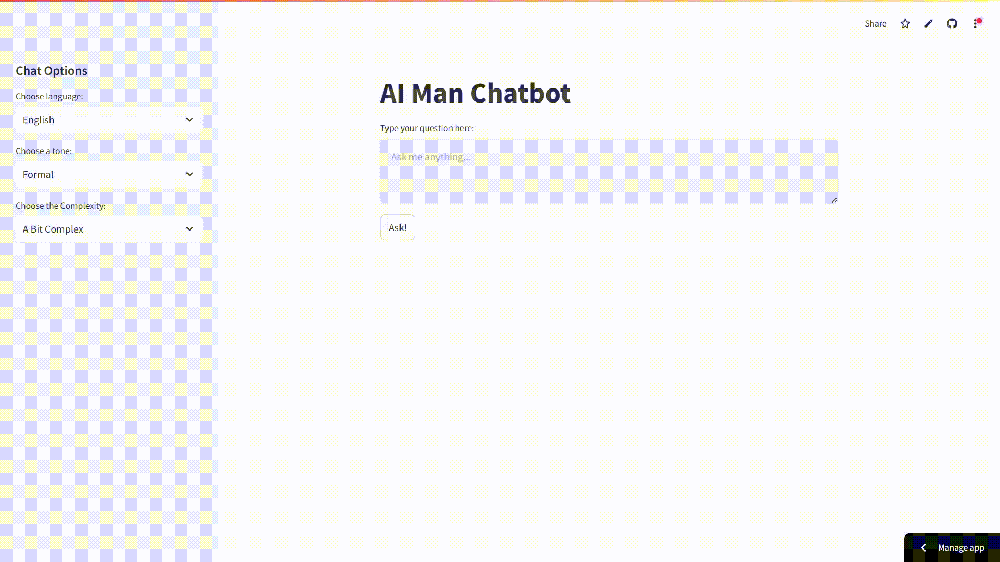

# AI Chatbot using AWS Bedrock
This project is a simple chatbot application built using LangChain, AWS Bedrock, and Streamlit. 
It currently utilizes Anthropic Claude-v2 model hosted on AWS Bedrock. 
The Advantage of using AWS bedrock is that we can change the AI model just by changing 1 line of code.
The chatbot offers customization options for language, tone, and response complexity.

# Requirements
- Python 3.8 or later
- An AWS  Account
- Required Python libraries: langchain,boto3,streamlit

# Installation
1. Clone the repository
 `git clone https://github.com/Codexx121/AWS-AIChatbot.git`

 - **Install Dependencies if not yet installed**
 `pip install langchain langchain_community boto3 streamlit`

2. Configure AWS Creds
   `aws configure --profile AIMan`

3. Run using Streamlit
   `streamlit run chatbot.py`

   **Altenatively it can be run using the hosted code on streamlit cloud**
   [Streamlit Cloud] (https://ai1aws1chatbot1.streamlit.app/)

# Output
If all is done right this is what you should be seeing

